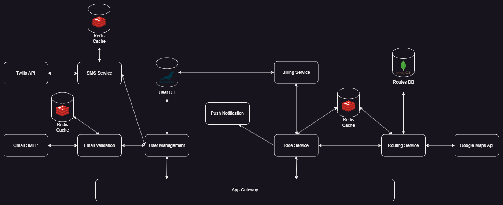

# Buscar App

O aplicativo Buscar visa conectar pessoas que realizam o mesmo trajeto todos os dias para que poossam oferecer ou pegar uma carona.

O projeto ainda encontra-se em estado de desenvolvimento, com data prevista para entrega no final de 2024. Esta sendo desenvolvido por alunos da turma de Análise e Desenvolvimento de Sistema do Centro Universitário Filadélfia (UNIFIL).
   

## Overview da arquitetura do projeto
